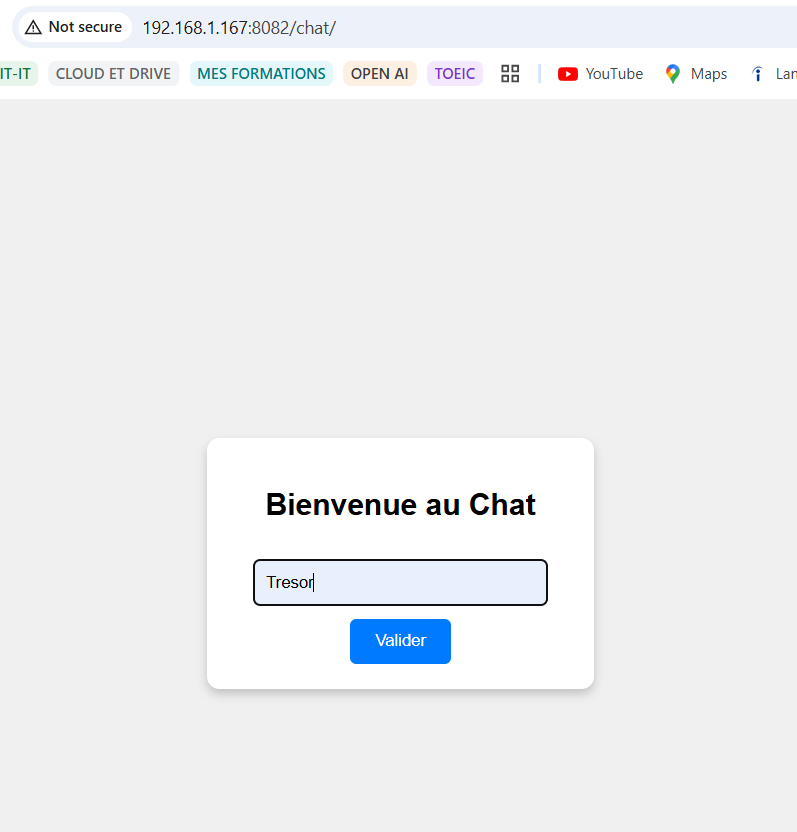

Application de chat en temps réel permettant à plusieurs utilisateurs de se connecter et de communiquer via WebSocket. Les utilisateurs entrent leurs noms avant d’accéder au chat.

# chat
    
### Interface d'indentification 

### Interface de Chat

